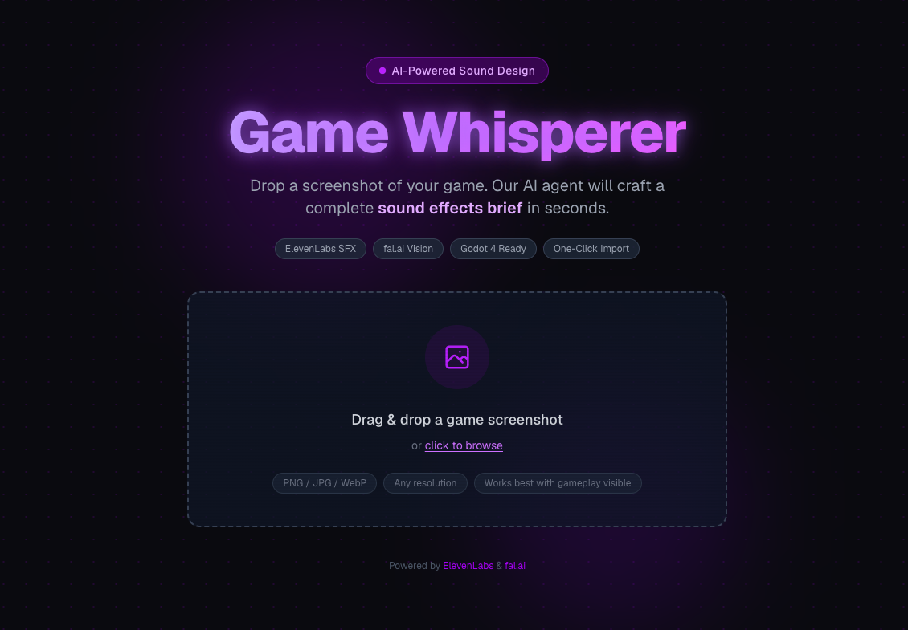
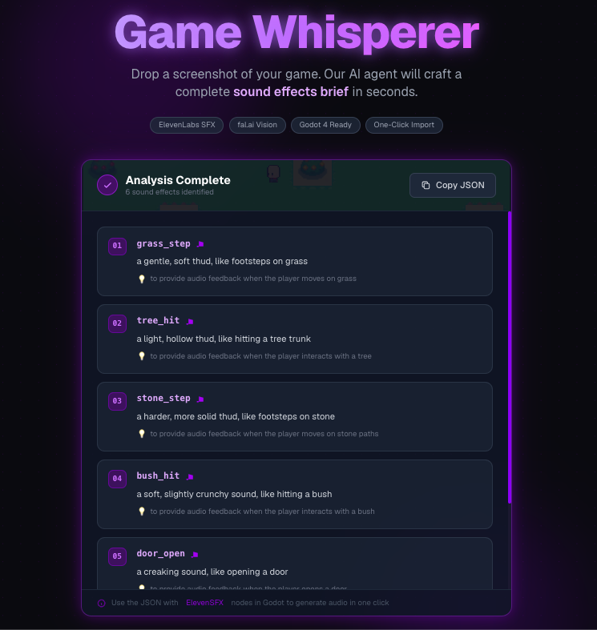
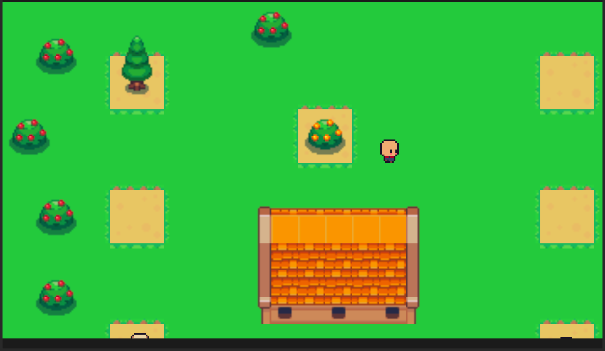
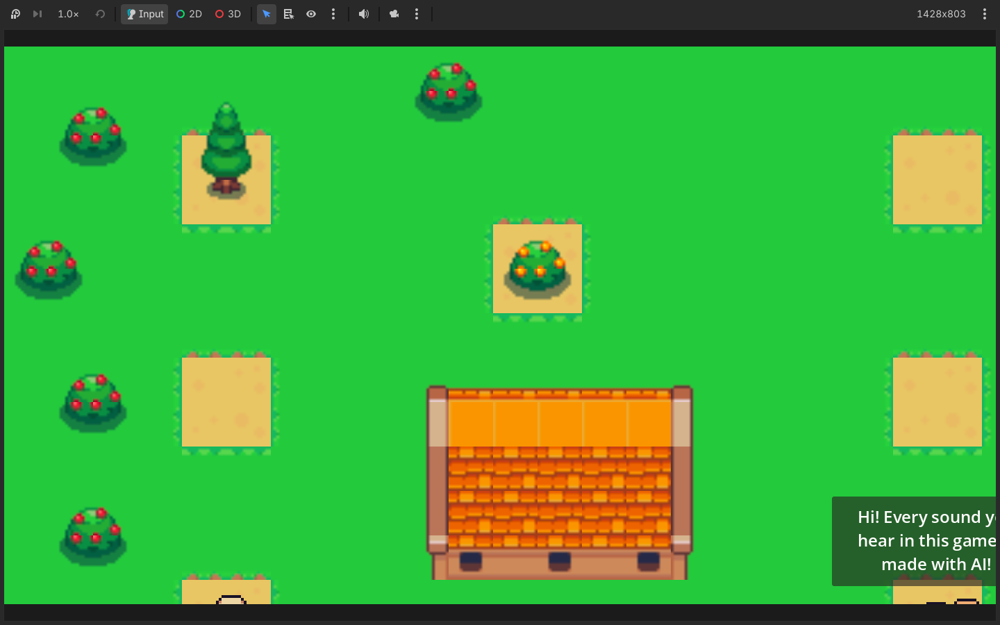
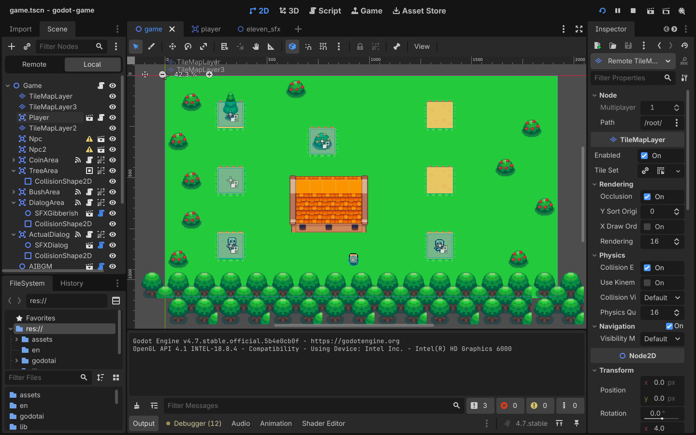

<div align="center">



# 🎮 Game Whisperer

### AI-Powered Sound Design for Games — Drop a Screenshot, Get a Full Audio Pipeline

[](https://godotengine.org)
[](https://nextjs.org)
[](https://elevenlabs.io)
[](https://falconllm.tii.ae)
[](LICENSE)

**Drop a screenshot of your game. Get a complete, production-ready sound effects brief in seconds — then generate and import every audio file into Godot with one click.**

[🎬 Watch Demo](https://www.loom.com/share/afb07def125e4edabed4370a491630ba) · [🌐 Web App](#-web-app) · [⚡ Quick Start](#-quick-start)

</div>

---

## 🔥 The Problem

Sound design is one of the most overlooked parts of game development. Indie developers spend **days** hunting for the right footstep, the right coin jingle, the right sword swing — browsing stock libraries, negotiating licenses, hiring voice actors.

**Game Whisperer makes that entire process disappear.**

---

## ✨ How It Works



**1.** Drop any game screenshot into the web app
**2.** AI vision model analyzes every element — terrain, characters, objects, environment
**3.** Returns a complete structured sound design brief: name, description, and purpose for every sound
**4.** Copy the JSON and import directly into Godot — nodes pre-configured and ready to generate

---

## 🎮 The Demo Game

A fully playable Godot 4 top-down RPG where **every single sound was generated by AI**. Not recorded. Not purchased from a stock library. Generated by typing a sentence.



### What You Can Hear

| Feature | How it works |
|---|---|
| 👣 **Footsteps** | AI-generated grass crunch, random pitch variation so it never sounds robotic |
| 🪓 **Tree chopping** | Axe impact fires exactly on animation frame 6 — perfectly synced |
| 🪙 **Coin pickup** | Coins float up and fade with an AI-generated jingle on every collect |
| 🌿 **Bush rustle** | Walk through bushes — ambient disturb sound triggers |
| 💬 **NPC gibberish** | Skeleton NPC speaks in AI-generated gibberish, typewriter text synced to audio |
| 🗣️ **AI voice dialog** | Second NPC uses real ElevenLabs TTS — text types in perfect sync with voice duration |
| 🎵 **Background music** | AI-generated ambient soundtrack plays throughout |

---

## 🗺️ Game Controls

| Key | Action |
|---|---|
| `W` | Move up |
| `S` | Move down |
| `A` | Move left |
| `D` | Move right |

---

## 🛠️ Godot Editor — AI Plugin Nodes



Three custom `@tool` nodes that work directly inside the Godot editor — no runtime code, no build step.

### ElevenSFX Node
Generate any sound effect in one click:
```
audio_name  →  "footstep"
description →  "soft grass footstep with slight crunch"
[Generate Audio] → MP3 saved to godotai/ instantly
```

### ElevenDialog Node
AI voice acting for any dialog:
```
voice_id  →  pick any ElevenLabs voice
dialog    →  type the NPC's lines
[Generate Dialog Audio] → TTS MP3 synced to text duration
```

### AiBgm Node
AI-generated background music:
```
description →  "peaceful sunny day pixel art RPG theme"
[Generate BGM] → WAV saved to godotai/bgm/
```

### AiAnalyze — One-Click Full Pipeline
The flagship feature:
1. Click **"Analyze SFX with AI"** in the Inspector
2. AI vision scans your entire scene
3. Suggests every sound effect your game needs
4. Click **"Import"** — auto-creates a scene with all `ElevenSFX` nodes pre-configured
5. Hit Generate on each node — done

---

## 🌐 Web App



The companion web app lets you analyze **any** game screenshot — not just this demo:

- Drag & drop any game screenshot
- AI returns structured JSON: `[{name, description, why}]`
- Copy and import directly to Godot

---

## ⚡ Quick Start

### Prerequisites
- [Godot 4.4](https://godotengine.org/download)
- [Node.js 20+](https://nodejs.org)
- API keys from [ElevenLabs](https://elevenlabs.io) and [Falcon AI](https://falconllm.tii.ae)

### 1. Clone
```bash
git clone https://github.com/atuljha-tech/gamewhisperer.git
cd gamewhisperer
```

### 2. Set up API keys for Godot
```bash
echo "your_eleven_labs_key" > godot-game/ELEVEN_LABS_API_KEY.txt
echo "your_falcon_ai_key"   > godot-game/FAL_API_KEY.txt
```

> Both files are gitignored — never committed.

**Where to get them:**
- **ElevenLabs** → [elevenlabs.io/app/settings/api-keys](https://elevenlabs.io/app/settings/api-keys) — enable **Sound Effects** + **Text to Speech** permissions
- **Falcon AI** → sign up at [falconllm.tii.ae](https://falconllm.tii.ae)

### 3. Set up the web app
```bash
cd web
cp .env.example .env.local
# paste your Falcon AI key into .env.local
npm install
npm run dev
```
Open [http://localhost:3000](http://localhost:3000)

### 4. Open the game in Godot
1. Open Godot 4.4
2. **Import** → browse to `godot-game/project.godot`
3. Click **2D** in the toolbar
4. Press **F5** to play

---

## 📁 Project Structure

```
gamewhisperer/
├── godot-game/              # Godot 4 game
│   ├── assets/              # Sprites, tilesets
│   ├── en/                  # Player, NPC, Coin scenes
│   ├── lib/                 # AI plugin nodes
│   │   ├── eleven_sfx.gd    # ElevenLabs SFX generator
│   │   ├── eleven_dialog.gd # ElevenLabs TTS dialog
│   │   ├── ai_bgm.gd        # AI music generator
│   │   └── ai_analyze.gd    # Vision-based SFX analyzer
│   ├── scenes/              # Area trigger scripts
│   ├── godotai/             # AI-generated audio output
│   └── game.tscn            # Main scene
│
└── web/                     # Next.js web app
    └── src/app/
        ├── page.tsx
        ├── components/
        └── api/upload/route.ts
```

---

## 🧠 Architecture

```
Screenshot → Falcon AI Vision → JSON SFX Brief → ElevenLabs API → MP3 in Godot
```

---

## 🏆 Built For Hackathon

This project was built for the **DEV.to Weekend Challenge: Passion Edition** and demonstrates the future of AI-native game development tooling — where sound design is no longer a bottleneck for indie developers.

> *"Every game deserves great sound. Now every developer can have it."*

---

## 📄 License

MIT

---

<div align="center">
Made with ❤️ using <strong>Godot 4</strong> · <strong>ElevenLabs</strong> · <strong>Falcon AI</strong> · <strong>Next.js</strong>
<br/>
<br/>
⭐ Star this repo if you found it useful!
</div>
